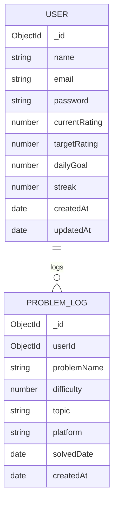

# 📌 ER Diagram – CPTrack

## Overview

This ER diagram represents the database schema for the CPTrack system.

The design focuses on:

- Clear entity separation
- Proper relationships
- Scalability
- Clean data normalization
- Backend-heavy structure aligned with system design principles

The system primarily revolves around:

- Users
- Problem Logs
- Analytics (derived, not stored permanently)

---

---

## Entities Description

### USER

Represents a registered competitive programmer.

Attributes:

- `_id` – Unique identifier
- `name` – User's name
- `email` – Unique email address
- `password` – Hashed password
- `currentRating` – Current competitive programming rating
- `targetRating` – Target rating goal
- `dailyGoal` – Number of problems to solve per day
- `streak` – Current consecutive solving days
- `createdAt` – Account creation timestamp
- `updatedAt` – Last update timestamp

---

### PROBLEM_LOG

Represents a solved problem entry logged by the user.

Attributes:

- `_id` – Unique identifier
- `userId` – Reference to USER
- `problemName` – Name of solved problem
- `difficulty` – Difficulty rating (e.g., 800–2000)
- `topic` – Topic tag (DP, Graph, Math, etc.)
- `platform` – Platform source (Codeforces, AtCoder, etc.)
- `solvedDate` – Date the problem was solved
- `createdAt` – Record creation timestamp

---

## Relationships

### USER → PROBLEM_LOG

- One USER can log many PROBLEM_LOG entries.
- Relationship type: One-to-Many (1:N)
- `PROBLEM_LOG.userId` acts as a foreign key referencing `USER._id`.

---

## Design Decisions

1. Normalization  
   - No redundant storage of analytics.
   - Analytics are generated dynamically using service layer logic.

2. Scalability  
   - Easy to extend with:
     - Contest history
     - Codeforces sync table
     - Topic master table
     - Friend connections

3. Security  
   - Password stored in hashed format only.
   - No sensitive data duplication.

4. Backend-Focused Design  
   - Clear separation of entities.
   - Supports layered architecture.
   - Designed for efficient querying (indexed by userId and solvedDate).

---

## Future Extensions (Optional Tables)

These are not part of Milestone 1 but can be added later:

- CONTEST_HISTORY
- CF_SYNC_DATA
- FRIENDS
- ACHIEVEMENTS
- NOTIFICATIONS

---

## Conclusion

The ER design ensures:

- Clean relational structure
- Proper normalization
- Backend scalability
- Strong alignment with RESTful architecture
- Maintainable and extendable database schema

This structure supports the full analytics and goal-tracking functionality of CPTrack.

