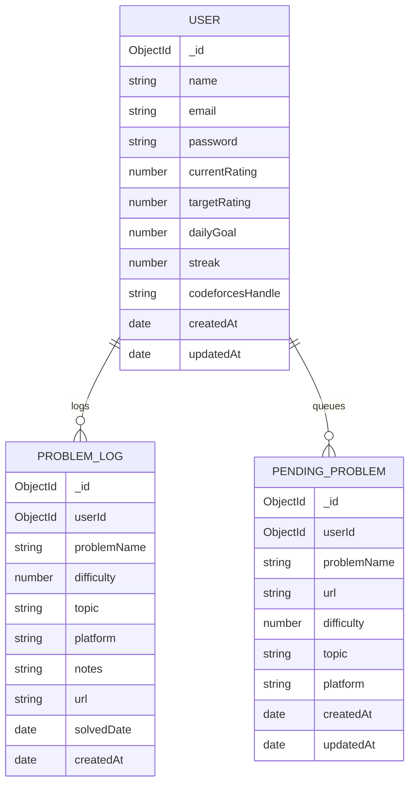

# 📌 ER Diagram – CPTrack

## Overview

This ER diagram represents the database schema for the CPTrack system.

The design focuses on:

- Clear entity separation
- Proper relationships
- Scalability
- Clean data normalization
- Backend-heavy structure aligned with system design principles

---

```mermaid
erDiagram

    USER ||--o{ PROBLEM_LOG : logs
    USER ||--o{ PENDING_PROBLEM : queues

    USER {
        ObjectId _id
        string name
        string email
        string password
        number currentRating
        number targetRating
        number dailyGoal
        number streak
        string codeforcesHandle
        date createdAt
        date updatedAt
    }

    PROBLEM_LOG {
        ObjectId _id
        ObjectId userId
        string problemName
        number difficulty
        string topic
        string platform
        string notes
        string url
        date solvedDate
        date createdAt
    }

    PENDING_PROBLEM {
        ObjectId _id
        ObjectId userId
        string problemName
        string url
        number difficulty
        string topic
        string platform
        date createdAt
        date updatedAt
    }
```

---

## Entities Description

### USER

Represents a registered competitive programmer.

| Attribute | Description |
|-----------|-------------|
| `_id` | Unique identifier |
| `name` | User's name |
| `email` | Unique email address |
| `password` | Hashed password |
| `currentRating` | Live Codeforces rating (synced from CF API) |
| `targetRating` | Target rating goal |
| `dailyGoal` | Number of problems to solve per day |
| `streak` | Current consecutive solving days |
| `codeforcesHandle` | Codeforces username for API sync |

---

### PROBLEM_LOG

Represents a solved problem entry logged by the user.

| Attribute | Description |
|-----------|-------------|
| `_id` | Unique identifier |
| `userId` | Reference to USER |
| `problemName` | Name of solved problem |
| `difficulty` | Difficulty rating (e.g., 800–3500) |
| `topic` | Topic tag (DP, Graph, Math, etc.) |
| `platform` | Platform source (Codeforces, LeetCode, etc.) |
| `notes` | User's approach notes and observations |
| `url` | Direct link to the problem |
| `solvedDate` | Date the problem was solved |

---

### PENDING_PROBLEM

Represents a to-do problem queued for solving.

| Attribute | Description |
|-----------|-------------|
| `_id` | Unique identifier |
| `userId` | Reference to USER |
| `problemName` | Name of the problem |
| `url` | Direct link to the problem |
| `difficulty` | Difficulty rating |
| `topic` | Topic tag |
| `platform` | Platform source |

---

## Relationships

| Relationship | Type | Description |
|-------------|------|-------------|
| USER → PROBLEM_LOG | One-to-Many | A user can log many solved problems |
| USER → PENDING_PROBLEM | One-to-Many | A user can queue many pending problems |

---

## Design Decisions

1. **Normalization** – No redundant storage. Analytics are generated dynamically using the service layer.
2. **Scalability** – Easy to extend with contest history, friend connections, achievements.
3. **Security** – Password stored in hashed format only. Profile API excludes password from responses.
4. **Backend-Focused** – Clear separation of entities. Designed for efficient querying (indexed by userId).
