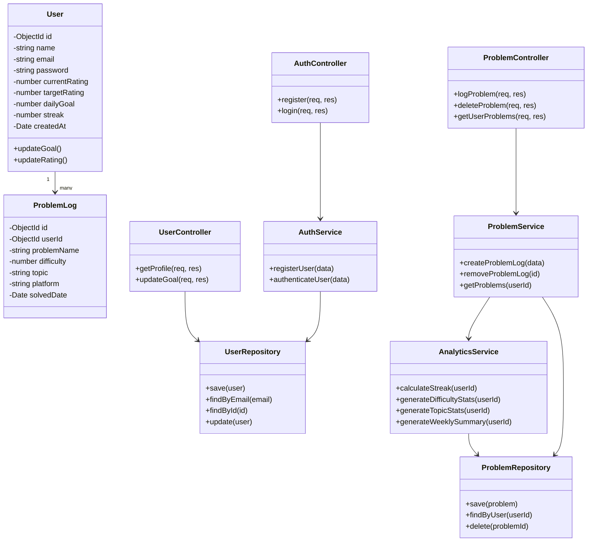

# 📌 Class Diagram – CPTrack

## Overview

This class diagram represents the major backend classes of the CPTrack system.

The backend follows a layered architecture:

- Controllers (handle HTTP requests)
- Services (business logic)
- Repositories (database abstraction)
- Models (data structure definitions)

The diagram demonstrates OOP principles such as:

- Encapsulation
- Abstraction
- Separation of Concerns
- Repository Pattern

---

---

## Class Responsibilities

### Models

**User**
- Stores authentication and goal-related data.
- Maintains rating, streak, and daily goal.

**ProblemLog**
- Represents a logged solved problem.
- Links to a specific user.

---

### Controllers

Controllers:
- Handle HTTP requests and responses.
- Delegate business logic to services.
- Do not directly access the database.

---

### Services

Services:
- Contain core business logic.
- Handle streak calculation.
- Generate analytics.
- Coordinate multiple repositories if required.

---

### Repositories

Repositories:
- Abstract database operations.
- Prevent direct database access from controllers/services.
- Enable easy database switching or mocking in tests.

---

## Design Justification

This class structure demonstrates:

- **Encapsulation** – Business logic resides in service classes.
- **Abstraction** – Controllers do not access the database directly.
- **Single Responsibility Principle** – Each class has a clear purpose.
- **Repository Pattern** – Database operations are separated from logic.
- **Scalability** – Easy to add new services (e.g., Codeforces API integration).

This backend-focused design aligns with the 75% backend scoring requirement.
