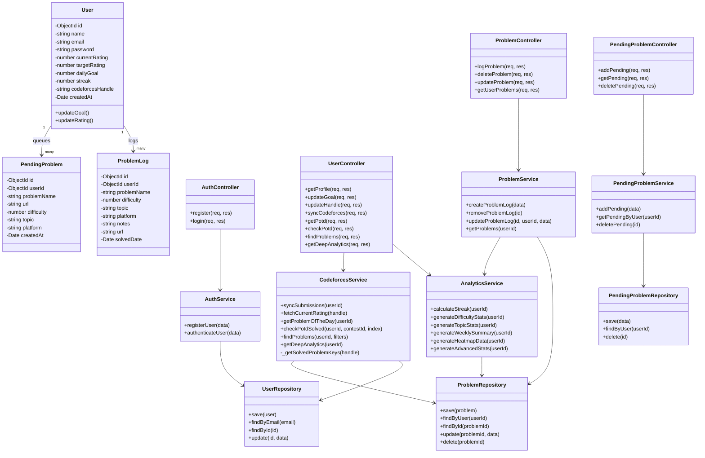

# 📌 Class Diagram – CPTrack

## Overview

This class diagram represents all backend classes of the CPTrack system.

The backend follows a layered architecture:

- Controllers (handle HTTP requests)
- Services (business logic)
- Repositories (database abstraction)
- Models (data structure definitions)

The diagram demonstrates OOP principles such as:

- Encapsulation
- Abstraction
- Separation of Concerns
- Repository Pattern

---

```mermaid
classDiagram

    %% =======================
    %% MODELS
    %% =======================

    class User {
        -ObjectId id
        -string name
        -string email
        -string password
        -number currentRating
        -number targetRating
        -number dailyGoal
        -number streak
        -string codeforcesHandle
        -Date createdAt
        +updateGoal()
        +updateRating()
    }

    class ProblemLog {
        -ObjectId id
        -ObjectId userId
        -string problemName
        -number difficulty
        -string topic
        -string platform
        -string notes
        -string url
        -Date solvedDate
    }

    class PendingProblem {
        -ObjectId id
        -ObjectId userId
        -string problemName
        -string url
        -number difficulty
        -string topic
        -string platform
        -Date createdAt
    }

    %% =======================
    %% CONTROLLERS
    %% =======================

    class AuthController {
        +register(req, res)
        +login(req, res)
    }

    class ProblemController {
        +logProblem(req, res)
        +deleteProblem(req, res)
        +updateProblem(req, res)
        +getUserProblems(req, res)
    }

    class PendingProblemController {
        +addPending(req, res)
        +getPending(req, res)
        +deletePending(req, res)
    }

    class UserController {
        +getProfile(req, res)
        +updateGoal(req, res)
        +updateHandle(req, res)
        +syncCodeforces(req, res)
        +getPotd(req, res)
        +checkPotd(req, res)
        +findProblems(req, res)
        +getDeepAnalytics(req, res)
    }

    %% =======================
    %% SERVICES
    %% =======================

    class AuthService {
        +registerUser(data)
        +authenticateUser(data)
    }

    class ProblemService {
        +createProblemLog(data)
        +removeProblemLog(id)
        +updateProblemLog(id, userId, data)
        +getProblems(userId)
    }

    class PendingProblemService {
        +addPending(data)
        +getPendingByUser(userId)
        +deletePending(id)
    }

    class AnalyticsService {
        +calculateStreak(userId)
        +generateDifficultyStats(userId)
        +generateTopicStats(userId)
        +generateWeeklySummary(userId)
        +generateHeatmapData(userId)
        +generateAdvancedStats(userId)
    }

    class CodeforcesService {
        +syncSubmissions(userId)
        +fetchCurrentRating(handle)
        +getProblemOfTheDay(userId)
        +checkPotdSolved(userId, contestId, index)
        +findProblems(userId, filters)
        +getDeepAnalytics(userId)
        -_getSolvedProblemKeys(handle)
    }

    %% =======================
    %% REPOSITORIES
    %% =======================

    class UserRepository {
        +save(user)
        +findByEmail(email)
        +findById(id)
        +update(id, data)
    }

    class ProblemRepository {
        +save(problem)
        +findByUser(userId)
        +findById(problemId)
        +update(problemId, data)
        +delete(problemId)
    }

    class PendingProblemRepository {
        +save(data)
        +findByUser(userId)
        +delete(id)
    }

    %% =======================
    %% RELATIONSHIPS
    %% =======================

    User "1" --> "many" ProblemLog : logs
    User "1" --> "many" PendingProblem : queues

    AuthController --> AuthService
    ProblemController --> ProblemService
    PendingProblemController --> PendingProblemService
    UserController --> AnalyticsService
    UserController --> CodeforcesService

    AuthService --> UserRepository
    ProblemService --> ProblemRepository
    ProblemService --> AnalyticsService
    PendingProblemService --> PendingProblemRepository

    AnalyticsService --> ProblemRepository
    CodeforcesService --> UserRepository
    CodeforcesService --> ProblemRepository
```

---

## Class Responsibilities

### Models

**User** – Stores authentication, goals, and Codeforces handle.

**ProblemLog** – Represents a solved problem with notes and URL.

**PendingProblem** – Represents a to-do problem queued for solving.

---

### Controllers

- Handle HTTP requests and responses.
- Delegate business logic to services.
- Do not directly access the database.

---

### Services

- **AuthService** – Registration and login with JWT.
- **ProblemService** – CRUD for solved problems with streak updates.
- **PendingProblemService** – CRUD for to-do problems.
- **AnalyticsService** – Streak, difficulty/topic stats, heatmap, advanced metrics.
- **CodeforcesService** – CF sync, POTD, problem finder, deep analytics (rating history, weak topics, upsolving).

---

### Repositories

- Abstract database operations.
- Enable easy database switching or mocking in tests.
- Prevent direct database access from controllers/services.

---

## Design Justification

- **Encapsulation** – Business logic resides in service classes.
- **Abstraction** – Controllers never access the database directly.
- **Single Responsibility Principle** – Each class has a clear purpose.
- **Repository Pattern** – Database operations are separated from logic.
- **Scalability** – Modular design supports adding new services easily.
