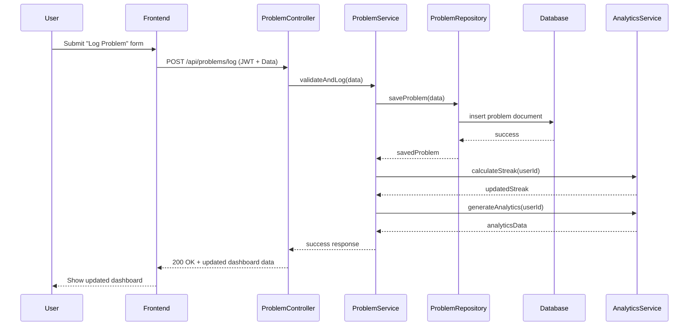

# 📌 Sequence Diagram – CPTrack

## Overview

This sequence diagram illustrates the main end-to-end flow of the system:

**User logs a solved problem**, and the system:

- Validates authentication
- Stores the problem log
- Updates streak
- Regenerates analytics
- Returns updated dashboard data

This demonstrates the layered backend architecture:

Frontend → Controller → Service → Repository → Database

---

---

## Flow Explanation

### 1. User Action
The user submits a solved problem using the frontend dashboard.

### 2. API Request
The frontend sends a POST request with JWT authentication to the backend.

### 3. Controller Layer
The controller:
- Validates request structure
- Passes data to the service layer

### 4. Service Layer
The service:
- Applies business logic
- Calls repository to save data
- Triggers streak recalculation
- Regenerates analytics

### 5. Repository Layer
The repository:
- Handles database interaction
- Inserts the problem log into MongoDB

### 6. Analytics Update
After successful insertion:
- Streak is recalculated
- Topic and difficulty analytics are updated

### 7. Response
The updated analytics data is returned to the frontend, and the dashboard refreshes.

---

## Design Justification

This sequence diagram demonstrates:

- Clean separation of concerns  
- Encapsulation of business logic  
- Repository pattern usage  
- No direct database access from controllers  
- Modular service architecture  

This structure improves scalability, maintainability, and testability.
