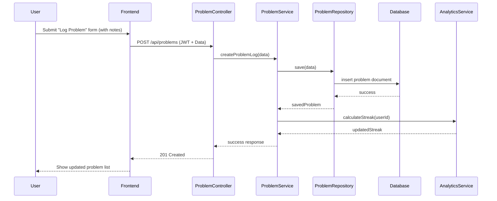
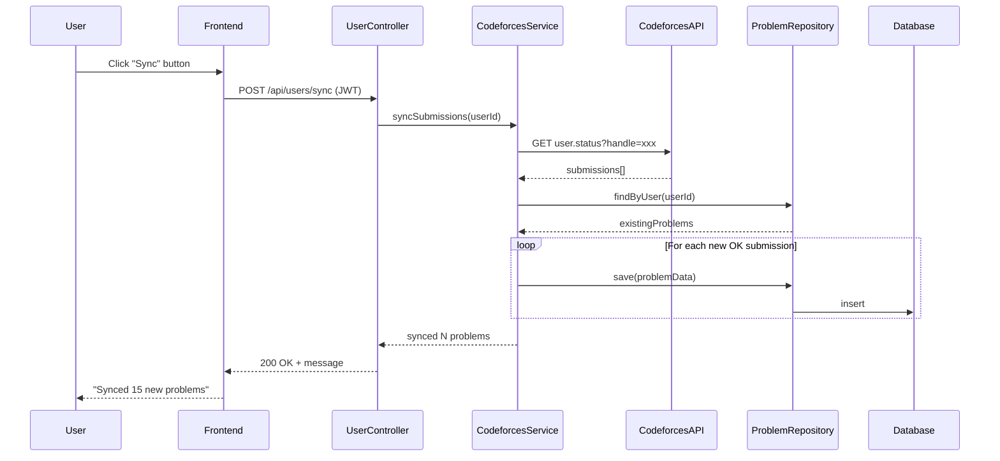
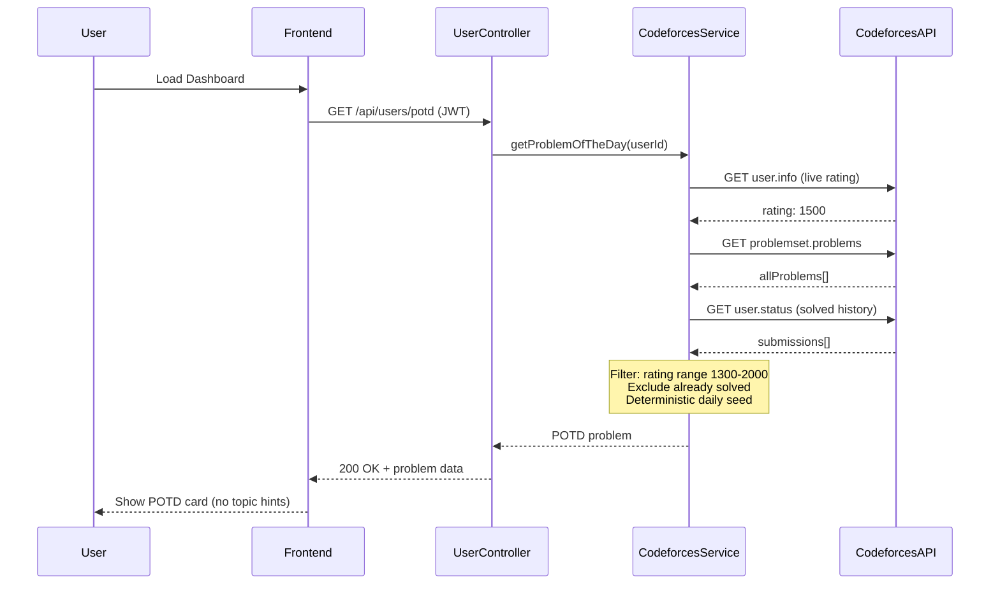

# 📌 Sequence Diagram – CPTrack

## Overview

These sequence diagrams illustrate the main end-to-end flows of the system:

1. **Log Problem** – User logs a solved problem with notes
2. **Codeforces Sync** – User syncs submissions from Codeforces
3. **Problem of the Day** – System generates a personalized daily challenge

---

## 1. Log a Solved Problem

```mermaid
sequenceDiagram

    participant User
    participant Frontend
    participant ProblemController
    participant ProblemService
    participant ProblemRepository
    participant Database
    participant AnalyticsService

    User->>Frontend: Submit "Log Problem" form (with notes)
    Frontend->>ProblemController: POST /api/problems (JWT + Data)

    ProblemController->>ProblemService: createProblemLog(data)

    ProblemService->>ProblemRepository: save(data)
    ProblemRepository->>Database: insert problem document
    Database-->>ProblemRepository: success
    ProblemRepository-->>ProblemService: savedProblem

    ProblemService->>AnalyticsService: calculateStreak(userId)
    AnalyticsService-->>ProblemService: updatedStreak

    ProblemService-->>ProblemController: success response
    ProblemController-->>Frontend: 201 Created
    Frontend-->>User: Show updated problem list
```

---

## 2. Codeforces Sync

```mermaid
sequenceDiagram

    participant User
    participant Frontend
    participant UserController
    participant CodeforcesService
    participant CodeforcesAPI
    participant ProblemRepository
    participant Database

    User->>Frontend: Click "Sync" button
    Frontend->>UserController: POST /api/users/sync (JWT)

    UserController->>CodeforcesService: syncSubmissions(userId)
    CodeforcesService->>CodeforcesAPI: GET user.status?handle=xxx
    CodeforcesAPI-->>CodeforcesService: submissions[]

    CodeforcesService->>ProblemRepository: findByUser(userId)
    ProblemRepository-->>CodeforcesService: existingProblems

    loop For each new OK submission
        CodeforcesService->>ProblemRepository: save(problemData)
        ProblemRepository->>Database: insert
    end

    CodeforcesService-->>UserController: synced N problems
    UserController-->>Frontend: 200 OK + message
    Frontend-->>User: "Synced 15 new problems"
```

---

## 3. Problem of the Day

```mermaid
sequenceDiagram

    participant User
    participant Frontend
    participant UserController
    participant CodeforcesService
    participant CodeforcesAPI

    User->>Frontend: Load Dashboard
    Frontend->>UserController: GET /api/users/potd (JWT)

    UserController->>CodeforcesService: getProblemOfTheDay(userId)

    CodeforcesService->>CodeforcesAPI: GET user.info (live rating)
    CodeforcesAPI-->>CodeforcesService: rating: 1500

    CodeforcesService->>CodeforcesAPI: GET problemset.problems
    CodeforcesAPI-->>CodeforcesService: allProblems[]

    CodeforcesService->>CodeforcesAPI: GET user.status (solved history)
    CodeforcesAPI-->>CodeforcesService: submissions[]

    Note over CodeforcesService: Filter: rating range 1300-2000<br/>Exclude already solved<br/>Deterministic daily seed

    CodeforcesService-->>UserController: POTD problem
    UserController-->>Frontend: 200 OK + problem data
    Frontend-->>User: Show POTD card (no topic hints)
```

---

## Design Justification

These diagrams demonstrate:

- Clean separation of concerns
- Encapsulation of business logic in services
- Repository pattern usage
- External API integration (Codeforces)
- No direct database access from controllers
- Modular service architecture
