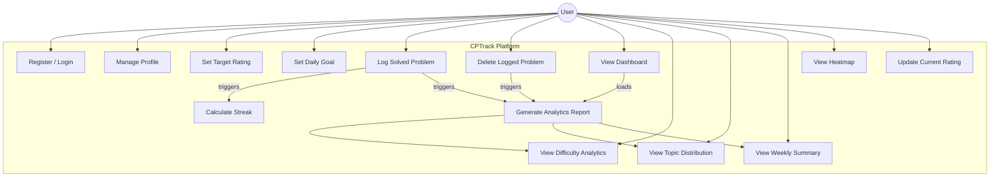

# 📌 Use Case Diagram – CPTrack

## Overview

This diagram shows all major use cases for the CPTrack platform, organized by the primary actor: **User**.

The system focuses on:

- Authentication
- Goal management
- Problem logging
- Analytics generation
- Streak calculation
- Heatmap visualization

---

---

## Use Case Descriptions

| Use Case | Actor | Description |
|----------|--------|------------|
| UC1 | User | Register a new account or login securely using credentials. |
| UC2 | User | Manage profile details such as name and current rating. |
| UC3 | User | Set or update target competitive programming rating. |
| UC4 | User | Define daily problem-solving goal. |
| UC5 | User | Log a solved problem with difficulty, topic, and date. |
| UC6 | User | Delete a previously logged problem entry. |
| UC7 | User | View dashboard summary of overall progress. |
| UC8 | User | View analytics grouped by difficulty level. |
| UC9 | User | View topic-wise performance distribution. |
| UC10 | User | View weekly problem-solving summary. |
| UC11 | User | View GitHub-style daily activity heatmap. |
| UC12 | System | Automatically calculate streak after logging a problem. |
| UC13 | System | Generate analytics data for dashboard views. |
| UC14 | User | Update current competitive programming rating manually. |

---
