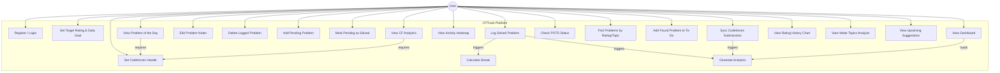

# 📌 Use Case Diagram – CPTrack

## Overview

This diagram shows all major use cases for the CPTrack platform, organized by the primary actor: **User**.

---

```mermaid
graph TB

    subgraph CPTrack Platform

        UC1["Register / Login"]
        UC2["Set Codeforces Handle"]
        UC3["Set Target Rating & Daily Goal"]
        UC4["Sync Codeforces Submissions"]
        UC5["Log Solved Problem"]
        UC6["Edit Problem Notes"]
        UC7["Delete Logged Problem"]
        UC8["Add Pending Problem"]
        UC9["Mark Pending as Solved"]
        UC10["View Dashboard"]
        UC11["View Activity Heatmap"]
        UC12["View Problem of the Day"]
        UC13["Check POTD Status"]
        UC14["Find Problems by Rating/Topic"]
        UC15["Add Found Problem to To-Do"]
        UC16["View CF Analytics"]
        UC17["View Rating History Chart"]
        UC18["View Weak Topics Analysis"]
        UC19["View Upsolving Suggestions"]
        UC20["Calculate Streak"]
        UC21["Generate Analytics"]

    end

    %% Actor
    User((User))

    %% User Use Cases
    User --> UC1
    User --> UC2
    User --> UC3
    User --> UC4
    User --> UC5
    User --> UC6
    User --> UC7
    User --> UC8
    User --> UC9
    User --> UC10
    User --> UC11
    User --> UC12
    User --> UC13
    User --> UC14
    User --> UC15
    User --> UC16
    User --> UC17
    User --> UC18
    User --> UC19

    %% System-driven
    UC5 -->|triggers| UC20
    UC5 -->|triggers| UC21
    UC4 -->|triggers| UC21
    UC10 -->|loads| UC21
    UC12 -->|requires| UC2
    UC16 -->|requires| UC2
```

---

## Use Case Descriptions

| Use Case | Actor | Description |
|----------|-------|-------------|
| UC1 | User | Register a new account or login with JWT authentication |
| UC2 | User | Set Codeforces handle for API sync |
| UC3 | User | Set or update target rating and daily problem goal |
| UC4 | User | Sync solved problems from Codeforces API |
| UC5 | User | Log a solved problem with difficulty, topic, platform, notes, URL |
| UC6 | User | Edit notes/approach on a previously solved problem |
| UC7 | User | Delete a logged problem |
| UC8 | User | Add a problem to the To-Do list |
| UC9 | User | Mark a pending problem as solved (moves to solved log) |
| UC10 | User | View dashboard with stats, charts, heatmap, POTD |
| UC11 | User | View GitHub-style daily activity heatmap |
| UC12 | User | View personalized Problem of the Day (unsolved, rating-based) |
| UC13 | User | Check if POTD was solved on Codeforces |
| UC14 | User | Browse Codeforces problems by rating range and topic |
| UC15 | User | Add a found problem directly to To-Do list |
| UC16 | User | View deep CF analytics (rating history, contest stats) |
| UC17 | User | View rating progression chart over all contests |
| UC18 | User | View topic-wise success rate analysis (weakest first) |
| UC19 | User | View upsolving suggestions from past contests |
| UC20 | System | Automatically calculate streak after logging a problem |
| UC21 | System | Generate analytics data for dashboard views |
